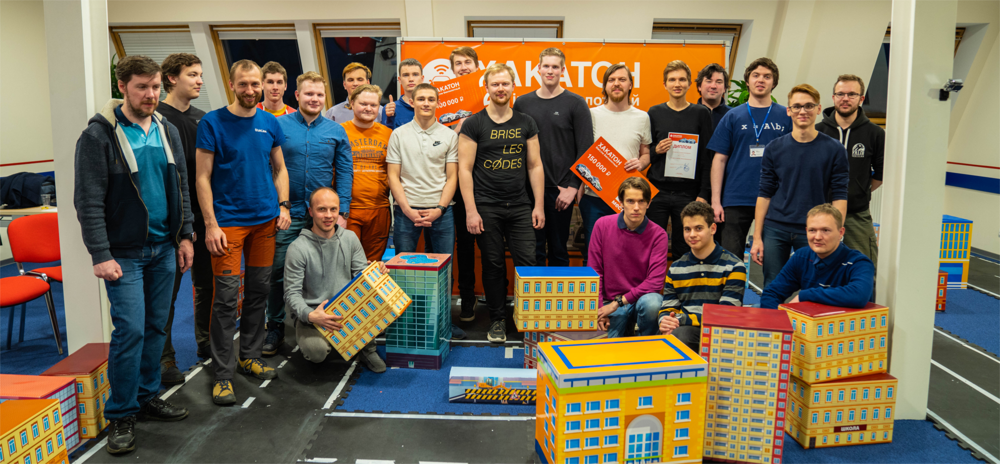

[Основной регламент мероприятия](Регламент_HSL_март_2020.pdf)

[Регламент проведения квалификационного этапа](Квалификация_HSL_март_2020.pdf)

[Список правил, дополняющих основной регламент](Дополнительные_правила_HSL_март_2020.pdf)

[Судейский листок с системой оценки решений очного этапа](Судейский_листок_HSL_март_2020.pdf)

## Квалификация

COEX: [Репозиторий](https://gitlab.com/sfalexrog/hackathon_kobuki/-/tree/devel) | [Видео простого решения](https://youtu.be/BqnwR_P1MU0), [Видео основного решения](https://youtu.be/PypPD3mdUhM)

АнтайтлеДДД: [Репозиторий](https://gitlab.com/Smehnov/hackathon_kobuki) | [Видео решения](https://www.loom.com/share/2945c6e48f3d46edb4b80833e8821a33)

Stimulator G: [Репозиторий](https://github.com/urpylka/starline-hackathon/) | [Видео решения](https://www.youtube.com/watch?v=Bpk09-oP4mI)

NON_STOP: [Репозиторий](https://gitlab.com/GrigoryV/hackathon_kobuki) | [Видео решения](https://drive.google.com/drive/folders/1d-b9vfNCTq4RNHDqgNP4nCk33isaEqO7)

The Alliance: [Репозиторий](https://github.com/urpylka/starline-hackathon/) | [Видео решения](http://cloud.mail.ru/public/WbBD%2F3WRBNqsjL)

## Очный этап

Запись трансляции с финала:

